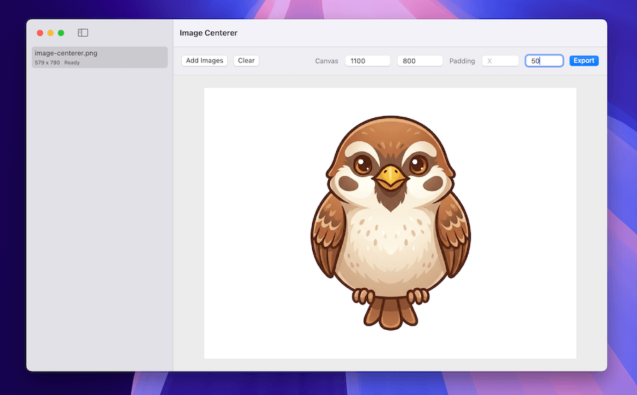

<h1 align="center">Owlign Image Centerer</h1>

<table>
  <tr>
    <td width="240" align="center" valign="top">
      
    </td>
    <td valign="middle">
      <strong>Owlign Image Centerer</strong> is a local macOS app for placing PNG and JPG images onto a fixed-size white canvas. It is built for batch image cleanup: choose images, choose the final canvas size, optionally add padding around the image, preview the result, and export processed files.
      <br /><br />
      The app does not upload images or store a library. All processing happens locally on the selected files.
    </td>
  </tr>
</table>

<p align="center">
  
</p>

## What It Does

For each selected image, Owlign Image Centerer creates a new output image with the requested pixel dimensions.

The processing rules are:

- Output canvas is filled with solid white or kept transparent, per the background toggle in the top bar.
- Supported inputs are `.png`, `.jpg`, and `.jpeg`.
- Output format follows the input format family, except in transparent mode, where every output is PNG (JPEG cannot store transparency).
- The original filename is preserved on export.
- If the destination filename already exists, the app writes `name 2.ext`, `name 3.ext`, and so on.
- Each input image is processed independently, so mixed source dimensions are valid in the same batch.
- The image is centered on the canvas.
- Padding X/Y is treated as extra background space around the image before fitting.
- Images are scaled down when the padded image would exceed the canvas.
- Images are never scaled up.
- Transparent PNG pixels are flattened against the canvas in white mode and preserved in transparent mode.

Example export names:

```text
avatar.png   -> avatar.png
photo.jpeg   -> photo.jpeg
image.jpg    -> image.jpg

avatar.png already exists:
avatar.png   -> avatar 2.png
```

## Build It Yourself

Owlign Image Centerer is distributed as source only — there is no prebuilt binary to download. Build the app locally:

```sh
git clone https://github.com/carlosinho/image-centerer.git
cd image-centerer
./scripts/package-app.sh
```

The finished app is written to `dist/Owlign.app`. Move it to `/Applications` or run it from `dist/` directly.

Because you compiled the app on your own machine, macOS Gatekeeper does not quarantine it: there is no "unidentified developer" warning and no right-click-to-open workaround. Quarantine only applies to files downloaded from the internet, so building from source avoids the problem entirely without Developer ID signing or notarization.

## Check for Updates

The app can tell you when a newer release is available on GitHub:

- **Owlign → Check for Updates…** in the menu bar checks immediately and always shows the result.
- On launch, the app checks automatically if the last check was more than a week ago. This check is silent: it only shows an alert when a newer release exists.

A check is a single HTTPS request to the GitHub API for the repository's latest release; nothing else is sent. Because the app is built from source, updating means pulling the repository and re-running the packaging script:

```sh
git pull
./scripts/package-app.sh
```

Development builds started with `swift run` have no embedded version number, so the scheduled check is skipped for them.

## Main User Flow

1. Open the app.
2. Click **Add Images** and select one or more PNG/JPG files, or drag them from Finder and drop them anywhere in the window.
3. The canvas width and height are initialized from the first successfully loaded image.
4. Edit canvas width/height if needed.
5. Optionally set X and Y padding.
6. Optionally turn on the **Transp.** toggle to keep the background transparent instead of white. The preview shows a checkerboard behind transparent areas.
7. Select an image in the sidebar to preview its processed result.
8. Click **Export**.
9. Choose an output folder.
10. The app processes every selected image, shows progress, and then shows exported/failed counts.

Preview updates live as the selected image, canvas size, or padding changes. Preview rendering is optimized for interactivity: the app cancels stale preview work while you type and renders a capped preview bitmap instead of running the full export encoder on every keystroke.

Exports run asynchronously so the window stays responsive. Use **Cancel** to stop a long batch after the current in-flight item finishes.

The app uses standard file picker dialogs. Input images can also be dragged and dropped onto the window; unsupported files and folders in a drop are ignored.

## Tech Stack

- Swift 6.2 package
- macOS 15 minimum target
- SwiftUI for the app UI
- AppKit `NSOpenPanel` for input/export folder selection and `NSImage` display in the app target
- CoreGraphics and ImageIO for image decoding, rendering, and encoding
- UniformTypeIdentifiers for PNG/JPEG format identifiers
- Foundation `URLSession` for the GitHub release update check
- Swift Testing for the test suite
- Shell packaging script using `swift build`, `sips`, `iconutil`, and `codesign`

There are no third-party dependencies.

## Project Structure

```text
Package.swift
Sources/
  ImageCenterer/
    ContentView.swift          SwiftUI UI and export workflow
    FileSelection.swift        macOS open panels
    ImageCentererApp.swift     app entry point and activation policy
    ImageJob.swift             UI job/status model
    UpdateChecker.swift        GitHub release check and update alerts
  ImageCentererCore/
    ImageCenteringProcessor.swift  image loading, fitting, rendering, encoding
    ExportFileNamer.swift          export destination naming
    UpdateCheck.swift              version comparison and check scheduling
Tests/
  ImageCentererCoreTests/
    ImageCenteringProcessorTests.swift  behavior tests for processing and naming
    UpdateCheckTests.swift              version comparison and schedule tests
scripts/
  package-app.sh              builds a local .app bundle
  test.sh                     runs swift test, adding toolchain paths when needed
.github/
  workflows/
    ci.yml                    GitHub Actions build/test/package check
VERSION                       current app version, read by package-app.sh
app-icon.png                  source image used for the packaged app icon
```

Generated files are written under `dist/` and `.build/`; both are ignored by git.

## Requirements

- macOS 15 or newer
- Swift 6.2 or newer
- Command-line tools that include `swift`, `sips`, `iconutil`, and `codesign`

The Apple Command Line Tools are enough; a full Xcode installation is not required. No environment variables are required.

## Run From Source

```sh
swift run ImageCenterer
```

The app explicitly sets itself as a regular foreground macOS app on launch, which is needed because it is run as a SwiftPM executable rather than from a normal `.app` bundle.

## Build And Verify

Build all targets:

```sh
swift build
```

Run the test suite:

```sh
./scripts/test.sh
```

The script wraps `swift test`. With a full Xcode installation, plain `swift test` also works; the script exists because machines with only the Command Line Tools need extra compiler flags to locate the Swift Testing framework, and it adds them automatically.

The suite generates temporary fixture images and verifies:

- smaller images are not scaled up
- larger images are scaled down to fit
- mixed width/height overflow is fitted correctly
- padding is applied before fitting
- JPEG output stays JPEG
- transparent PNGs flatten over white
- transparent background keeps canvas pixels fully transparent
- transparent background converts JPEG output to PNG
- unsupported extensions fail
- differently sized images are processed independently
- export naming preserves original names and increments conflicts
- version strings parse and compare numerically for the update check
- the scheduled update check fires only after a week has passed

## License

Owlign Image Centerer is available under the MIT License. See `LICENSE`.
